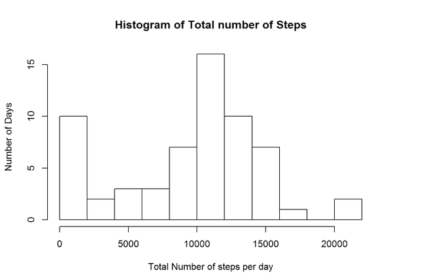
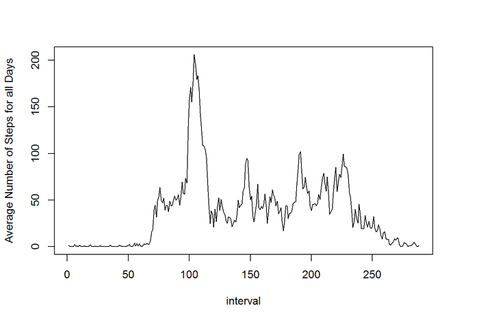
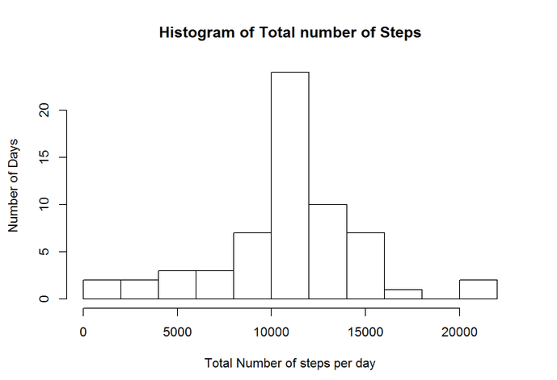
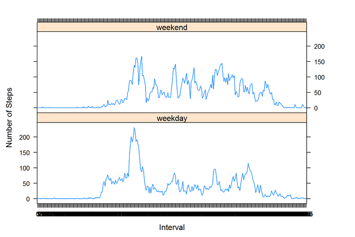

# Analysis of Activity Monitering Data

The Data is present on a file by name **activity.csv** in the work-area.
The data from the file is extracted into a data.frame variable - *activity_data*.
The dimensions of *activity_data* is 17568x3. It has three columns viz. steps, date and interval.
In order to find mean, median and total number of steps, we would have to group the data by date column.


```r
activity_data <- read.csv("activity.csv")
suppressMessages(library(dplyr))
summary <- summarize(group_by(activity_data,date),mean = mean(steps,na.rm=TRUE),
                     median = median(steps,na.rm=TRUE),total = sum(steps,na.rm=TRUE))
head(summary,10)
```

```
## Source: local data frame [10 x 4]
## 
##          date     mean median total
## 1  2012-10-01      NaN     NA     0
## 2  2012-10-02  0.43750      0   126
## 3  2012-10-03 39.41667      0 11352
## 4  2012-10-04 42.06944      0 12116
## 5  2012-10-05 46.15972      0 13294
## 6  2012-10-06 53.54167      0 15420
## 7  2012-10-07 38.24653      0 11015
## 8  2012-10-08      NaN     NA     0
## 9  2012-10-09 44.48264      0 12811
## 10 2012-10-10 34.37500      0  9900
```

Computed data has been stored in the variable - *summary*. Dimensions of *summary* is 61x4.
Histogram of the total number of steps taken each day has been plotted below.


```r
hist(as.vector(summary$total),
     xlab="Total Number of steps per day",
     ylab="Number of Days",
     breaks=10, 
     main="Histogram of Total number of Steps")
```

 

The mean and median number of steps taken for each day is reported in the data-frame printed above.

We can consolidate the data into a new data.frame, so that we can easily plot a time-series.
For this we will be needing spread function from tidyr package.

```r
suppressMessages(library(tidyr))
consolidated_data <- spread(activity_data,interval,steps)
dim(consolidated_data)
```

```
## [1]  61 289
```
The dimesion of *consolidated_data* is 61x289.

Each row is a set observations for given day. So we have 61 days of observation.
Each column represents a different interval. The column name is the interval-indetifier.
Now we will be averaging the number of steps for all days for each column of interval and we will be plotting the the corresponding time-series of averages.

```r
interval_means <- colMeans(consolidated_data[,-1],na.rm=TRUE)
plot.ts(interval_means,type='l',ylab='Average Number of Steps for all Days',xlab='interval')
```

 

From the data it evident that the **interval-835** has the highest average number of steps of all the days.
Now total numbe rmissing values of the dataset is given by the following.

```r
count <- 0
for(i in 1:nrow(activity_data)){
        if(is.na(activity_data[i,1])){
                count <- count+1
        }
}
count
```

```
## [1] 2304
```
We have 2304 null entries in our data. **We can substitute these entries with the corresponding interval averages over all the given days of observation.** We will create a new data-set - *activity_tidy_data* in which we replace the <NA> values with corresponding 5-min interval averages.

```r
#format(Sys.time(), "%Y-%m-%d")
meanvalues <- round(colMeans(select(consolidated_data,-date),na.rm=TRUE),digits=6)
consolidated_tidy_data <- consolidated_data
for(i in 1:(nrow(consolidated_tidy_data))){
        for(j in 2:ncol(consolidated_tidy_data)){
                if(is.na(consolidated_tidy_data[i,j])){
                        consolidated_tidy_data[i,j] <- meanvalues[j-1]
                }
        }
}
activity_tidy_data <- arrange(gather(consolidated_tidy_data,interval,steps,-date),date,interval)
```
Now let us summarize the this tidy data after grouping by date and plot the histogram of total number of steps for each day.

```r
 summary_tidy_data <- summarize(group_by(activity_tidy_data,date),mean = mean(steps,na.rm=TRUE),
                      median = median(steps,na.rm=TRUE),total = sum(steps,na.rm=TRUE))
 head(summary_tidy_data,10)
```

```
## Source: local data frame [10 x 4]
## 
##          date     mean   median    total
## 1  2012-10-01 37.38260 34.11321 10766.19
## 2  2012-10-02  0.43750  0.00000   126.00
## 3  2012-10-03 39.41667  0.00000 11352.00
## 4  2012-10-04 42.06944  0.00000 12116.00
## 5  2012-10-05 46.15972  0.00000 13294.00
## 6  2012-10-06 53.54167  0.00000 15420.00
## 7  2012-10-07 38.24653  0.00000 11015.00
## 8  2012-10-08 37.38260 34.11321 10766.19
## 9  2012-10-09 44.48264  0.00000 12811.00
## 10 2012-10-10 34.37500  0.00000  9900.00
```


```r
 hist(as.vector(summary_tidy_data$total),
      xlab="Total Number of steps per day",
      ylab="Number of Days",
      breaks=10, 
      main="Histogram of Total number of Steps")
```

 

Now let us analyze the weekdays and weekends stat.
We will first identify the dates by their day, and classify them accordingly as Weekdays and Weekends. Then we will filter them and plot them in two separate panels.

```r
activity_tidy_data$date <- as.Date(activity_tidy_data$date, format = "%Y-%m-%d")
activity_tidy_data <- mutate(activity_tidy_data, day="Weekday",days=weekdays(date))
for(i in 1:(nrow(activity_tidy_data))){
         if(activity_tidy_data[i,5]=="Sunday"||activity_tidy_data[i,5]=="Saturday"){
                 activity_tidy_data[i,4] <- "Weekend"
         }
}

activity_tidy_data$day <- as.factor(activity_tidy_data$day)
filter_data1 <- select(spread(filter(select(activity_tidy_data,-days),day=="Weekday"),date,steps),-day)
filter_data2 <- select(spread(filter(select(activity_tidy_data,-days),day=="Weekend"),date,steps),-day)

plotting_data <- 
arrange(
  rbind(
        select(mutate(filter_data1,mean=rowMeans(filter_data1[,-1]),day1="weekday"),
               steps = mean,interval,day = day1),
        select(mutate(filter_data2,mean=rowMeans(filter_data2[,-1]),day1="weekend"),
               steps = mean,interval,day = day1)
        ),
  interval)

plotting_data$day <- as.factor(plotting_data$day)
suppressMessages(library(lattice))
xyplot(steps ~ interval|levels(plotting_data$day),
       data=plotting_data,
       type="l",
       xlab="Interval",
       ylab="Number of Steps",
       layout=c(1,2))
```

 
